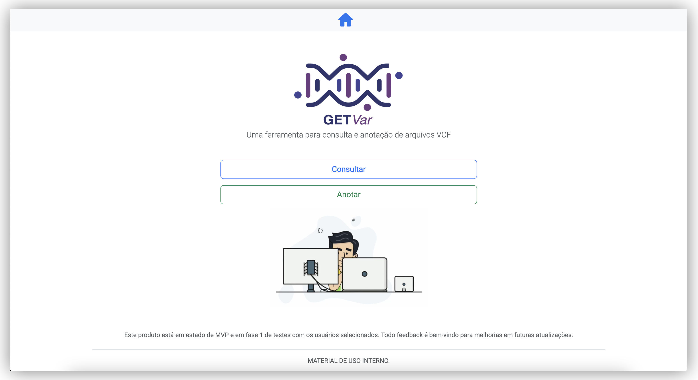
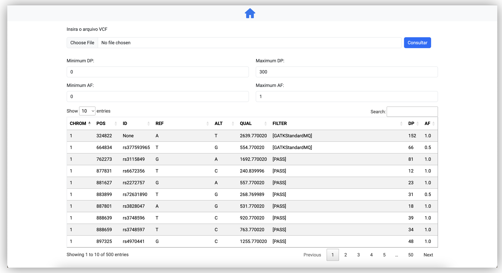
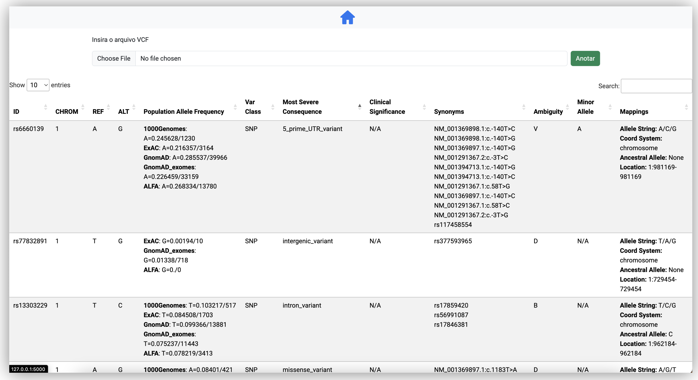

# GET<i>Var</i> 

O **GET<i>Var</i>** é uma ferramenta desenvolvida para **análise e anotação de variantes genéticas**. Com um workflow eficiente, a ferramenta integra dados de variantes genômicas para identificar e interpretar anotações de variantes de forma rápida e precisa em bancos de dados públicos.

## Diagrama de Fluxo da Aplicação

Abaixo, você encontra um diagrama de fluxo que detalha da aplicação.



## Funcionalidades

- **Análise de Variantes**: Processamento e visualização dados de variantes genéticas.
- **Anotação Funcional**: Integração de variantes com consulta em bancos de dados genéticos.
- **Automatização**: Workflow padronizado para maior eficiência.

## Workflow da Aplicação

1. **Entrada de Dados**:

   - Apenas arquivos **VCF** são válidos como entrada.

2. **Identificação de Variantes**:

   - A aplicação faz anotações com os seguintes campos:
     - **ID**: Identificador único da variante no banco de dados de referência.
     - **CHROM**: Cromossomo onde a variante está localizada.
     - **REF**: Alelo de referência no genoma.
     - **ALT**: Alelo alternativo identificado.
     - **Population Allele Frequency**: Frequência da variante em populações conhecidas.
     - **Var Class**: Classe da variante, como SNV (Single Nucleotide Variant) ou INDEL.
     - **Most Severe Consequence**: Consequência mais grave da variante em relação à função do gene.
     - **Clinical Significance**: Relevância clínica da variante com base em dados de referência.
     - **Synonyms**: Nomes alternativos ou identificadores da variante.
     - **Ambiguity**: Nível de ambiguïdade na identificação da variante.
     - **Minor Allele**: Alelo menos frequente encontrado na população.
     - **Mappings**: Informações adicionais de diferentes bancos e referências genômicas.

   - Os bancos consultados incluem **dbSNP**, **Ensembl** e **ClinVar**.

3. **Anotação Funcional**:

   - Integração com bancos de dados como dbSNP, ClinVar e Ensembl para fornecer informações funcionais e clínicas sobre as variantes.

## Tecnologias Utilizadas

- **Linguagem**: Python
- **Framework**: Snakemake, Bootstrap e Flask
- **Bancos de Dados**: Integrações com dbSNP, ClinVar e Ensembl

## Estrutura do Projeto

- **`main.py`**: Arquivo principal para executar a aplicação.
- **`api_getters.py`**: Contém funções para integrar e buscar dados externos.
- **`views.py`**: Gerencia as rotas e interações do usuário.
- **`utils.py`**: Arquivo com funções auxiliares para processamento de dados.
- **`Snakefile`**: Define os workflows automatizados usando Snakemake para gerenciar pipelines de análise.
- **`templates/`**: Arquivos HTML para visualização de resultados.
- **`static/`**: Arquivos de imagens e vídeos usados pela aplicação.
  - **`images/`**: Contém ícones, logos e outras imagens.
  - **`videos/`**: Contém vídeos ilustrativos ou de demonstração.
- **`requirements.txt`**: Lista de dependências necessárias para o projeto.
- **`.gitignore`**: Arquivo para ignorar arquivos e diretórios desnecessários no controle de versão.
- **`LICENSE`**: Arquivo contendo a licença do projeto.

## Requisitos de Instalação

Certifique-se de ter as seguintes ferramentas instaladas:

- Python >= 3.8
- Gerenciador de pacotes `pip`

## Instalação

1. Clone o repositório:

   ```bash
   git clone https://github.com/madsondeluna/getvar_mvp.git
   cd getvar_mvp
   ```

2. Crie um ambiente virtual (opcional, mas é recomendado):

   ```bash
   python3 -m venv venv
   source venv/bin/activate
   ```

3. Instale o Snakemake:

   ```bash
   pip install snakemake
   ```

## Execução

1. Execute o snakemake:
 ```bash
   snakemake
   ```

2. Acesse a aplicação no navegador em:
 ```
   http://localhost:5000
   ```

## Exemplo de Uso

Submeta um arquivo **VCF** através da interface web. O sistema processará os dados, realizará as anotações e disponibilizará um relatório final em formato tabular que pode ser filtrada através das respectivas anotações. 

## Telas do MVP

1. Tela inicial:


<br>

2. Tela de visualização do VCF bruto e funçõs de filtros:


<br>

3. Resultados das anotação das varientes via **dbSNP**, **Ensembl** e **ClinVar**: 


## Informaçõs Adicionais de Uso 

As APIs REST do dbSNP, ClinVar e Ensembl possuem um limite de até 30 requisições por solicitação. Por isso, a aplicação pode apresentar instabilidade ou lentidão em alguns momentos. Além disso, os servidores dessas plataformas ocasionalmente podem ficar instáveis ou não responder adequadamente às requisições. Nesses casos, o manual das APIs recomenda a resubmissão dos dados para completar o processo de anotação.

## Licença

Este projeto está licenciado sob a [Licença MIT](https://opensource.org/licenses/MIT). Consulte o arquivo LICENSE para mais informações.

## Contato

Madson Aragão\
[madsondeluna@gmail.com](mailto\:madsondeluna@gmail.com)\
[LinkedIn](https://www.linkedin.com/in/madsonaragao)

<i>Created by Madson Aragão in somewhere, where bytes and biomolecules collide.</i>
